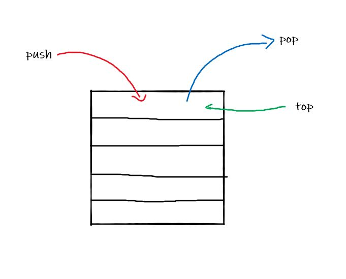

# In memory storage
## What is a ‘call’?
A call is used to invoke a function. 

## How many ‘calls’ can happen at once?
One at a time from top to bottom

## What does LIFO mean?
Last in First Out 

## Draw an example of a call stack and the functions that would need to be invoked to generate that call stack.

## What causes a Stack Overflow?
When there is a recursive function without an exit point

# Javascript Errors
## What is a ‘refrence error’?
When you try to use a variable that is not defined

## What is a ‘syntax error’?
When something cant be parsed in syntax.

## What is a ‘range error’?
This occurs when to manipulate a obects length with an invalid length.

## What is a ‘tyep error’?
When trying to accesss types that are incompatable.

## What is a breakpoint?
Breaks the code from the line you put debugger

## What does the word ‘debugger’ do in your code?
Causes a breakpoint

# Things I want to more about?